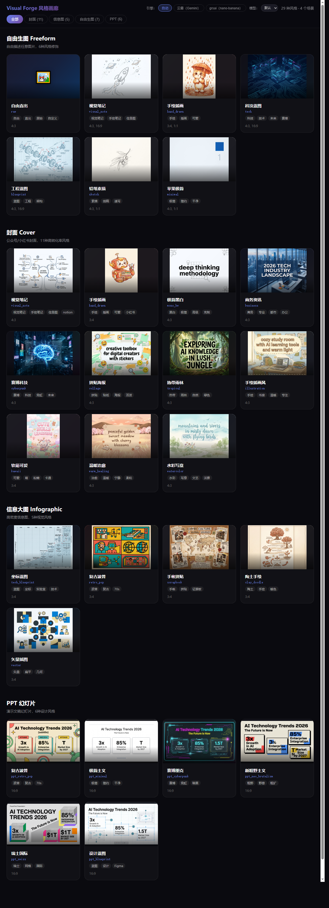

# Visual Forge — AI 图像生成引擎

> 一句话出图，28 种预设风格，双引擎自动 fallback，零外部依赖。
>
> **内部技能名**：`/image`（作为 Claude Code 技能使用时的触发词）

Visual Forge 是一个面向内容创作者的 AI 图像生成工具。它将复杂的 Prompt 工程封装为 28 种预设风格，通过自然语言驱动，支持封面、信息图、自由生图、PPT 四大场景。内置双引擎自动 fallback 机制，当主引擎不可用时自动切换备用引擎，确保生图成功率。

**28 种预设风格一览：**



---

## 特性

- **自然语言驱动** — 说"赛博风封面 AI技能"即可出图，自动匹配风格和比例
- **28 种预设风格** — 封面 11 种、信息图 5 种、自由生图 6 种、PPT 6 种
- **双引擎 Fallback** — 主引擎失败时自动切换备用引擎
- **多模型支持** — 可在 CLI 参数、配置文件中灵活切换模型
- **零外部依赖** — 纯 Python stdlib，不需要 `pip install`
- **风格画廊** — 可视化浏览所有风格、查看 Prompt、一键复制调用命令
- **飞书自动推送** — 生图完成自动推送到飞书群

---


## 让 AI 帮你安装

> **不会配置环境？直接把下面这段话复制给你的 AI 编程助手（Claude Code / Cursor / Copilot 等），它会自动完成安装和配置。**

```
请帮我安装 Visual Forge 图像生成引擎。

1. git clone https://github.com/shaoyi1991/visual-forge.git
2. 阅读项目中的 AGENTS.md，了解项目结构和配置要求
3. 复制 .env.example 为 .env，引导我填入 API Key
4. 运行一条测试命令验证安装成功

如果我的环境缺少 Python 3.10+，也请帮我安装。
```

> 没有图像生成 API？项目中已配置两个引擎：yunwu（Gemini 代理）和 grsai（nano-banana），只需任选一个申请密钥即可。

---

## 快速开始

### 环境要求

- Python 3.10+
- 至少一个图像生成 API 的密钥

### 1. 克隆项目

```bash
git clone https://github.com/shaoyi1991/visual-forge.git
cd visual-forge
```

### 2. 配置环境变量

在项目根目录创建 `.env` 文件：

```bash
# ===== 主引擎（yunwu / Gemini）=====
LLM_API_KEY=sk-your-api-key
LLM_BASE_URL=https://yunwu.ai/v1

# ===== 备用引擎（grsai / nano-banana）=====
BANANA_API_URL=http://grsai.dakka.com.cn/v1/draw/nano-banana
BANANA_API_KEY=sk-your-api-key
BANANA_OSS_ID=your-oss-id

# ===== 输出参数 =====
VF_PROVIDER=auto          # auto / yunwu / grsai
VF_IMAGE_SIZE=2K          # 1K / 2K / 4K
VF_OUTPUT_FMT=jpg         # jpg / png / webp
VF_JPG_QUALITY=85         # 1-95
```

> 只需配置你想用的引擎密钥，不需要两个都配。`VF_PROVIDER=auto` 时会按 yunwu → grsai 顺序尝试。

### 3. 一句话出图

```bash
# 用预设风格（推荐）
python scripts/generate.py \
  --config config/engine.json \
  --style cyberpunk --prompt "a cat in neon city" \
  --out output.jpg

# 自由 Prompt
python scripts/generate.py \
  --config config/engine.json \
  --prompt "a watercolor painting of mountains at sunset, no text no watermark" \
  --out output.jpg --aspect-ratio "4:3"
```

---

## 使用方式

### 命令行参数

| 参数 | 说明 | 示例 |
|------|------|------|
| `--config` | 引擎配置文件路径 | `config/engine.json` |
| `--prompt` | 图像描述（英文） | `"a cat reading a book"` |
| `--style` | 预设风格 ID | `cyberpunk`, `kawaii`, `sketch` |
| `--provider` | 指定引擎（覆盖环境变量） | `auto`, `yunwu`, `grsai` |
| `--model` | 指定模型（覆盖默认） | `gemini-3-pro-image-preview` |
| `--out` | 输出文件路径 | `output.jpg` |
| `--aspect-ratio` | 画面比例 | `4:3`, `3:4`, `16:9` |
| `--image-size` | 分辨率 | `1K`, `2K`, `4K` |
| `--reference` | 参考图路径（支持多张） | `ref1.jpg ref2.jpg` |
| `--prompt-file` | Prompt 文件（YAML 头部） | `prompt.md` |

### 优先级规则

```
--model       > engine.json default_model > 环境变量
--provider    > VF_PROVIDER 环境变量
--aspect-ratio > --style 中的 ratio      > 默认 4:3
```

### 常用命令示例

```bash
# 赛博科技风封面
python scripts/generate.py --config config/engine.json \
  --style cyberpunk --prompt "AI and human coexistence" \
  --out cover_cyberpunk.jpg

# 指定引擎 + 模型
python scripts/generate.py --config config/engine.json \
  --provider yunwu --model gemini-3-pro-image-preview \
  --style watercolor --prompt "mountain landscape" \
  --out watercolor.jpg

# 仅使用 grsai 引擎
python scripts/generate.py --config config/engine.json \
  --provider grsai --style hand_drawn --prompt "a cute cat" \
  --out cute_cat.jpg

# 自由 Prompt（不使用预设风格）
python scripts/generate.py --config config/engine.json \
  --prompt "a majestic eagle soaring over mountains, oil painting style, no text" \
  --out eagle.jpg --aspect-ratio "16:9" --image-size 4K
```

---

## 四大场景与 28 种风格

### 场景一：封面 Cover（11 种）

适用于公众号、小红书等平台的内容封面。变量 `{METAPHOR}` 会被替换为用户描述。

| 风格 ID | 名称 | 比例 | 关键词 | 视觉特征 |
|---------|------|------|--------|---------|
| `visual_note` | 视觉笔记 | 4:3 | 视觉笔记/手绘笔记/notion | 扁平信息图+铅笔质感，白底蓝橙点缀 |
| `hand_drawn` | 手绘插画 | 3:4 | 手绘/插画/可爱/小红书 | 彩铅手绘风，暖橘赤陶色调 |
| `mono_bw` | 极简黑白 | 4:3 | 黑白/极简/高级/克制 | 纯黑白，大量留白，理性克制 |
| `business` | 商务资讯 | 4:3 | 商务/专业/都市/资讯 | 城市俯拍，深蓝灰白，专业感 |
| `cyberpunk` | 赛博科技 | 4:3 | 赛博/科技/霓虹/未来 | 深蓝黑底，霓虹发光，HUD面板 |
| `collage` | 拼贴海报 | 4:3 | 拼贴/贴纸/海报/活泼 | 撕纸拼贴，荧光笔，卡通贴纸 |
| `tropical` | 热带雨林 | 4:3 | 热带/雨林/自然/探索 | 雨林背景，绿棕金自然色调 |
| `illustration` | 手绘插画风 | 4:3 | 手绘/书房/温暖/专注 | 温暖书房，彩铅质感，气泡装饰 |
| `kawaii` | 软萌可爱 | 3:4 | 可爱/萌/粉嫩/少女 | 粉色梦幻，卡通贴纸，软萌动物 |
| `warm_healing` | 温暖治愈 | 4:3 | 治愈/温暖/宁静/柔和 | 金色草原，樱花树，猫和奶茶 |
| `watercolor` | 水彩写意 | 4:3 | 水彩/写意/文艺/淡雅 | 水彩晕染，山峦天空，艺术感 |

### 场景二：信息大图 Infographic（5 种）

适用于知识科普、数据可视化等高密度信息展示。变量 `{TOPIC}` 会被替换。

| 风格 ID | 名称 | 比例 | 关键词 |
|---------|------|------|--------|
| `tech_blueprint` | 坐标蓝图 | 3:4 | 蓝图/坐标/实验室/技术 |
| `retro_pop` | 复古波普 | 3:4 | 波普/复古/70s |
| `scrapbook` | 手帐拼贴 | 3:4 | 手帐/拼贴/证据板 |
| `clay_doodle` | 陶土手绘 | 3:4 | 陶土/手绘/暖色 |
| `vector` | 矢量插图 | 3:4 | 矢量/扁平/几何 |

### 场景三：自由生图 Freeform（6 种）

自由描述任意图片，风格作为修饰词叠加。用户的描述会追加到 `modifier` 之后。

| 风格 ID | 名称 | 支持比例 | 关键词 |
|---------|------|---------|--------|
| `visual_note` | 视觉笔记 | 4:3, 16:9 | 视觉笔记/手绘笔记/信息图 |
| `hand_drawn` | 手绘插画 | 3:4, 1:1 | 手绘/插画/可爱 |
| `tech` | 科技蓝图 | 4:3, 16:9 | 科技/技术/未来/赛博 |
| `blueprint` | 工程蓝图 | 4:3, 16:9 | 蓝图/工程/架构 |
| `sketch` | 铅笔素描 | 4:3, 1:1 | 素描/线稿/速写 |
| `minimal` | 苹果极简 | 4:3, 1:1 | 极简/简约/干净 |

### 场景四：PPT 幻灯片（6 种）

生成 16:9 演示文稿风格图片。变量 `{title}`, `{subtitle}`, `{stats}` 会被替换。

| 风格 ID | 名称 | 关键词 |
|---------|------|--------|
| `ppt_retro_pop` | 复古波普 | 波普/复古/70s |
| `ppt_minimal` | 极简主义 | 极简/简约/干净 |
| `ppt_cyberpunk` | 赛博朋克 | 赛博/霓虹/暗黑 |
| `ppt_neo_brutalism` | 新粗野主义 | 粗野/野兽/粗犷 |
| `ppt_swiss` | 瑞士国际 | 瑞士/网格/国际 |
| `ppt_blueprint` | 设计蓝图 | 蓝图/设计/Figma |

---

## 双引擎架构

```
用户请求
  │
  ├─ VF_PROVIDER=auto（默认）
  │   ├─ 尝试 yunwu（Gemini generateContent API）
  │   │   └─ 重试 2 次 → 全部失败 → fallback
  │   └─ 尝试 grsai（nano-banana REST API）
  │       └─ 重试 1 次 → 失败 → 报错
  │
  ├─ VF_PROVIDER=yunwu → 仅用云雾（不 fallback）
  └─ VF_PROVIDER=grsai → 仅用 grsai（不 fallback）
```

| 特性 | yunwu（云雾） | grsai |
|------|-------------|-------|
| 协议 | Gemini generateContent REST | nano-banana 专有 REST |
| 认证 | `x-goog-api-key` | `Bearer` + `oss-id` |
| 响应格式 | base64 inlineData（解码即图） | JSON → 下载 URL |
| 输出质量 | 高 | 中 |
| 平均耗时 | 30-80s | 10-20s |

---

## 扩展指南

### 添加新模型

编辑 `config/engine.json`，在对应 provider 的 `models` 数组中追加：

```json
{
  "providers": {
    "yunwu": {
      "name": "云雾（Gemini）",
      "base_url_env": "LLM_BASE_URL",
      "api_key_env": "LLM_API_KEY",
      "default_model": "gemini-3.1-flash-image-preview",
      "models": [
        {"id": "gemini-3.1-flash-image-preview", "name": "Flash（快）"},
        {"id": "gemini-3-pro-image-preview", "name": "Pro（精）"},
        {"id": "your-new-model-id", "name": "新模型显示名"}
      ]
    }
  }
}
```

然后通过 CLI 使用：

```bash
python scripts/generate.py --config config/engine.json \
  --model your-new-model-id \
  --style cyberpunk --prompt "..." --out output.jpg
```

### 添加新风格

编辑 `config/prompts.yaml`，在对应场景下追加：

```yaml
cover:
  # ... 已有风格 ...

  my_new_style:                          # 风格 ID（CLI --style 用这个名字）
    name: "我的新风格"                     # 显示名称
    keywords: ["新风格", "自定义", "demo"] # 自然语言匹配关键词
    ratio: "4:3"                          # 默认比例
    prompt: |                             # Prompt 模板（英文）
      your custom prompt here with {METAPHOR} as placeholder,
      describe the visual style, color palette, composition,
      no text no watermark, {ratio} composition
```

关键规则：
- **封面**用 `{METAPHOR}` 变量 → 会被用户描述替换
- **信息图**用 `{TOPIC}` 变量
- **自由生图**用 `modifier` 字段（不是 `prompt`），用户的描述会追加到 modifier 之后
- **PPT** 用 `{title}`, `{subtitle}`, `{stats}` 变量
- Prompt **必须是英文**
- 必须包含 `no text no watermark`
- 建议在末尾注明比例（如 `4:3 composition`）

### 添加新引擎（Provider）

**1. 在 `.env` 中添加引擎的环境变量：**

```bash
NEW_ENGINE_API_URL=https://api.new-engine.com/v1/generate
NEW_ENGINE_API_KEY=sk-your-key
```

**2. 在 `config/engine.json` 中注册：**

```json
{
  "providers": {
    "yunwu": { "..." : "..." },
    "grsai": { "..." : "..." },
    "new_engine": {
      "name": "新引擎名称",
      "api_url_env": "NEW_ENGINE_API_URL",
      "api_key_env": "NEW_ENGINE_API_KEY",
      "default_model": "model-name",
      "models": [
        {"id": "model-name", "name": "显示名"}
      ]
    }
  }
}
```

**3. 在 `scripts/generate.py` 中添加生成函数：**

```python
def _generate_via_new_engine(prompt, out_path, aspect_ratio, config):
    """新引擎生图路径"""
    api_url = os.getenv("NEW_ENGINE_API_URL")
    api_key = os.getenv("NEW_ENGINE_API_KEY")
    model = config.get("new_engine_model", "model-name")
    # ... 实现引擎的 API 调用逻辑 ...
    # ... 将结果写入 out_path ...
```

然后在 `main()` 的 provider 分发逻辑中加入新引擎的分支。

### 更新风格画廊

修改 `config/prompts.yaml` 或 `config/engine.json` 后，风格画廊 HTML（`config/style-gallery.html`）中的 `STYLES` 和 `PROVIDER_MODELS` 数据需要同步更新。

同时需要重新生成画廊截图（用于飞书推送）：

```bash
# Chrome headless 截全页图
"/path/to/chrome" --headless=old --disable-gpu \
  --screenshot=config/previews/style-gallery-overview.png \
  --window-size=1200,3300 \
  "file:///path/to/config/style-gallery.html"
```

---

## 项目结构

```
visual-forge/
├── README.md                           # 本文档
├── SKILL.md                            # 元技能入口（Claude Code 技能定义）
├── config/
│   ├── engine.json                     # 引擎配置（providers、模型列表）
│   ├── prompts.yaml                    # 统一提示词（28 种风格定义）
│   ├── style-gallery.html              # 风格画廊（可视化浏览器）
│   └── previews/                       # 风格预览图（28 张 + 画廊总览）
│       ├── cover_*.jpg                 # 封面风格预览（11 张）
│       ├── info_*.jpg                  # 信息图风格预览（5 张）
│       ├── free_*.jpg                  # 自由生图风格预览（6 张）
│       ├── ppt_*.jpg                   # PPT 风格预览（6 张）
│       └── style-gallery-overview.png  # 画廊总览截图
├── scripts/
│   └── generate.py                     # 生图引擎（双引擎 + --style + --provider）
└── references/
    ├── mode-cover.md                   # 封面模式工作流
    ├── mode-infographic.md             # 信息大图模式工作流
    └── mode-freeform.md                # 自由生图模式工作流
```

### 配置文件职责

| 文件 | 职责 | 改什么 |
|------|------|--------|
| `.env` | API 密钥、URL、输出参数 | 换密钥、换端点 |
| `config/engine.json` | 引擎注册、模型列表、默认模型 | 加模型、加引擎 |
| `config/prompts.yaml` | 风格定义（名称、关键词、Prompt 模板） | 加风格、改 Prompt |
| `config/style-gallery.html` | 可视化浏览器（内含 STYLES 数据） | 改画廊 UI |

---

## 设计决策

| 决策 | 原因 |
|------|------|
| **Prompt 全英文** | 主流图像模型（Gemini、GPT-image）对英文理解远优于中文 |
| **prompts.yaml 而非 JSON** | YAML 支持多行字符串，写 Prompt 更自然 |
| **零外部依赖** | stdlib-only 意味着开箱即用，不需要 `pip install` |
| **engine.json 存模型列表** | 模型变动频繁，独立于密钥管理 |
| **.env 只存密钥和 URL** | 敏感信息与业务配置分离，方便 .gitignore |
| **双引擎 auto fallback** | 单引擎不可用时自动切换，提高生图成功率 |

---

## 常见问题

### Q: 生图超时怎么办？

默认超时 120 秒。可以在 `.env` 中调整：

```bash
LLM_TIMEOUT=180  # 秒
```

### Q: 如何切换默认模型？

编辑 `config/engine.json` 中的 `default_model` 字段：

```json
{"providers": {"yunwu": {"default_model": "gemini-3-pro-image-preview"}}}
```

或通过 CLI 临时覆盖：`--model gemini-3-pro-image-preview`

### Q: 如何添加新的图像生成 API？

参见上方 [添加新引擎](#添加新引擎provider) 章节。核心步骤：`.env` 加密钥 → `engine.json` 注册 → `generate.py` 加调用函数。

### Q: 为什么生成图片中有文字？

当前 Prompt 模板均包含 `no text no watermark`，但 AI 模型不总是严格遵循。可以尝试在 Prompt 中加强调（如 `ABSOLUTELY NO TEXT NO LETTERS NO WORDS`）。

---

## License

MIT License

---

## 致谢
- 双引擎架构参考了 Gemini generateContent API 和 nano-banana REST API
